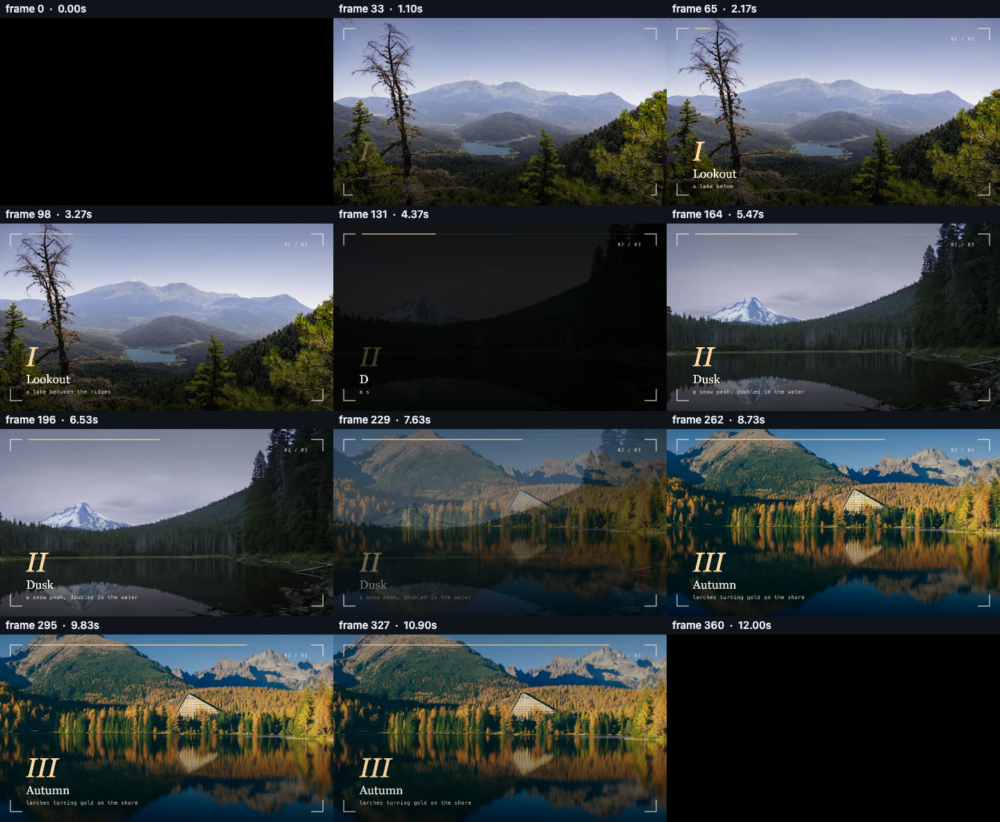
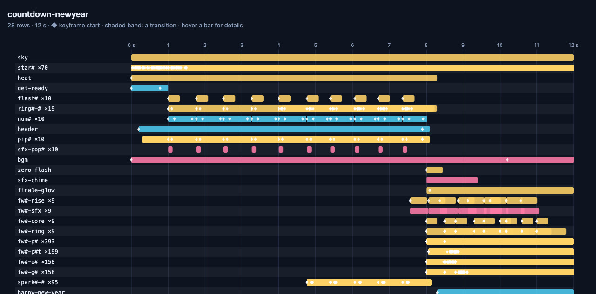

A video is hard to judge from code, so pixi-effects ships ways to look at it. They matter most when an AI wrote the video, but they are just as useful for yours.

## One command: check

```bash
npx pixi-effects check my-video.html
```

It opens your page in a private headless Chrome and reports, in one go:

- **warnings** the library printed (every one says what to change);
- **layout** problems found by `movie.inspect` over the whole timeline: text off the canvas, cut by an edge, empty, or overlapping other text (overlaps are listed for you to look at, since they are often on purpose);
- **sound**: `movie.inspectAudio()`: the loudness of the mix (LUFS, true peak, clipping, silence, scene by scene), advice and a list of problems; `waveform.png` draws the mix with the scene edges and when each sound starts;
- **fonts**: a web font whose file did not load fails the check; a text layer none of whose fonts is installed is listed for review (it is drawn in a fallback font);
- **a real export**, decoded again: its size, length and loudness per second;
- a **contact sheet** (`sheet.png`, twelve labelled frames), the video's **poster** (`poster.jpg`) and a **timeline** (`timeline.html`) to open;
- for a presentation (a movie with `stops`): **`stops.png`**, one picture for every stop in order, and the number of stops and pages. The picture at a stop is what the audience looks at while it waits, so check each one. The check also lists any stop where the picture is **still changing** (a stop that lands before its animation has ended); `--strict` makes that a failure.

Options worth knowing while you work:

| Option | What it does |
|---|---|
| `--no-export` | skips the real export: a check takes a few seconds instead of the length of the video |
| `--at 3.5,title@end,50%,f120` | writes the pictures at those moments (`frames/*.png`) and one sheet (`at.png`); `name@start`, `name@mid` and `name@end` are a named layer's start, middle and last frame |
| `--onion 1:3` | `onion.png`: eight frames of seconds 1 to 3 laid over one another, the later the stronger, so a movement leaves a trail (its path and its easing) |
| `--draft` | the export is half size, low quality, no motion blur: a much smaller file (the drawing is not faster) |
| `--query "name=Aiko"` | adds to the page address, for a page that reads it (see the cookbook's batch recipe) |

`check` looks at the first and last frame of every scene (a named top-level composition of a second or more) and a frame every 0.25 s, up to 240 frames, so a title cut off at the edge of a scene is not missed. The mix is judged by ITU-R BS.1770 loudness: web video is typically −14 to −16 LUFS; quieter or louder than −24 or −9 LUFS, little headroom (true peak above −1 dBTP) and silent stretches are listed as `notes`, not failures; clipping, or a true peak above 0 dBTP (the file will distort), fails.

The exit code is 0 when there is nothing to fix and 1 otherwise, so it also works in CI. This is its real output for the piece in the demo further down:

```text
pixi-effects check — examples/gallery/still-water.html
  page      ready in 2 s · 1280×720 · 30 fps · 360 frames (12 s) · audio
  warnings  none
  layout    no cut-off / off-canvas text over 61 frames (movie.inspect)
  audio     3 source(s) · mix peak -19.4 dBFS · no issues (movie.inspectAudio)
  export    mp4 ok · 8.55 MB · video 12.03 s 1280×720 · audio 12.031 s, peak -19.4 dBFS
  files     check-out/still-water/sheet.png  timeline.html  still-water.mp4  report.json
RESULT: OK — nothing to fix. Look at the contact sheet before you call it done.
```

The last line is on purpose: *check* cannot tell you whether a video is **good**, only that nothing is **broken**. Look at the contact sheet.



*`sheet.png`: twelve labelled frames. The cheapest way to check a whole animation by eye.*

## See the timeline, and scrub it

```bash
npx pixi-effects view my-video.html
```

Your browser opens on the page with a **timeline under it**: every layer as a bar on a time axis, ◆ at each keyframe, a shaded band for each transition, and a red playhead that follows the movie.

- Click or drag on the timeline to seek; click a layer's name to jump to where it starts.
- Space plays, ← and → step a frame (Shift: a second), + and − (or Ctrl/⌘ and the wheel) zoom; the whole movie fits the width at the start, and the names stay in place while you scroll sideways.
- Layers whose names differ only by numbers (`ring1`, `ring2`…) share one row, so a video with seven hundred generated layers is a screenful.

The same chart is available in code: `movie.timelineChart()` returns an HTML page, `movie.timelineData()` returns the rows, and `movie.timelineSvg()` returns just the chart.



*The timeline of the countdown piece: 706 layers become 28 rows, because layers named `ring10-0`, `ring9-1`… share a row.*

{{demo examples/gallery/countdown-newyear.html}}

## One movement in one picture

`await movie.onionSkin({ from: 1, to: 3, count: 8, as: 'dataURL' })` returns one image of the frames between two moments, laid over one another with the later ones stronger. A thing that moves leaves a trail: even steps mean constant speed, steps that bunch up mean slow, and what stays still stays itself. It is the quickest way to judge an easing.

## In code

| Call | Gives you |
|---|---|
| `await movie.inspect(frame)` | where every layer is drawn at that frame, and the layout problems |
| `movie.inspectAudio()` | each sound's time, loudness and pitch, and the problems |
| `await movie.contactSheet({ count: 12, as: 'dataURL' })` | many frames on one labelled image |
| `await movie.snapshot(frame, { as: 'dataURL' })` | one frame as an image |
| `await movie.contactSheet({ frames: movie.stops.map(s => s.frame), as: 'dataURL' })` | one picture of every stop of a deck |
| `await movie.stopImages({ which: 'pages' })` | every page of a deck as its own image (see [Presenting](presenting.html)) |

## The warnings are instructions

pixi-effects prints a console warning for almost every mistake: an unknown option (with a "did you mean"), a keyframe outside its layer, a text style typo, a mix that would clip. They are written to say what to change, so read them before anything else.
