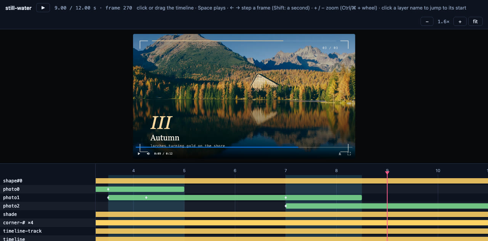

pixi-effects was designed so that an AI can write the whole video as one HTML file and **verify it without watching it**. This page is the workflow.

## 1. Give the AI the skill

An AI does best when it reads a short, exact description of the format before it writes anything:

| File | What it is |
|---|---|
| [`ai/SKILL.md`](https://github.com/yjmtmtk/pixi-effects/blob/main/ai/SKILL.md) | the workflow: write, check, look, fix. Point a coding agent at it first |
| [`ai/reference/cheatsheet.md`](https://github.com/yjmtmtk/pixi-effects/blob/main/ai/reference/cheatsheet.md) | every layer type, property, unit and rule on a few pages |
| [`ai/reference/recipes.md`](https://github.com/yjmtmtk/pixi-effects/blob/main/ai/reference/recipes.md) | tested recipes the AI can adapt |
| [`ai/reference/pitfalls.md`](https://github.com/yjmtmtk/pixi-effects/blob/main/ai/reference/pitfalls.md) | the mistakes that were actually made, so they are not repeated |
| [`ai/template.html`](../ai/template.html) | a starter page: a harness that collects every warning into `window.__logs`, and `window.movie` / `window.__ready` for tools |
| [`llms.txt`](../llms.txt) and [`llms-full.txt`](../llms-full.txt) | the same material in one file, for a chat window |

If the package is installed, they are in `node_modules/pixi-effects/ai/`.

## 2. Ask for a video, not for code

A prompt that works is specific about what you see and hear, and says what to read:

> Read `ai/SKILL.md` and follow it. Make a 12-second, 1280×720 title sequence for a bakery called "Rye & Sons": a warm cream background, the name typed out, a line that draws itself under it, a soft chime at the end. Save it as `bakery.html`. Run the check and fix everything it reports, then show me the contact sheet.

For a talk, ask for pages: *"Make a five-page deck with `deck()`, one idea per page, bullets that appear one step at a time as stops, a slide transition between pages, and speaker notes. Then run the check and look at `stops.png`."* For visuals that follow music, ask for `audioEnvelope()` and `react()` (the AI analyses the file before `init`). See [Presenting](presenting.html) and [Audio](audio.html).

Useful things to say: the **size and duration**, the **moment that should be the poster** (the picture before play), the **palette** (two or three colours), what appears **when**, what you **hear**, and *"use only system fonts and generated shapes"* if you have no assets.

## 3. The AI checks its own work

This is the part that makes it practical. The AI runs one command and reads the result:

```bash
npx pixi-effects-check bakery.html
```

It reports warnings, layout problems, sound problems and a real export; writes a **contact sheet** the AI can look at; and exits 0 or 1. The AI loops: write, check, look, fix. See [Reviewing your video](review.html) for what each line means.


## 4. You look at it, scrubbing a timeline

When the AI says it is done, **you** open it:

```bash
npx pixi-effects-view bakery.html
```

You get the page with a timeline under it. It is also the best way to give feedback: *"the line under the title starts too early: it begins at 0.2 s, move it to where the typing ends"* is easy to say when you can see the bars. Ask the AI to give layers meaningful `name`s so the rows are readable.



## 5. Get the file

```bash
npx pixi-effects-render bakery.html -o bakery.mp4
```

## Why this works

- **One format.** A video is a tree of plain objects; there is nothing hidden in a project file, so the AI sees everything it made.
- **Mistakes are loud.** An unknown option, a keyframe outside its layer, a text style typo: each prints a warning that says what to change (and "did you mean"), and the template collects them in `window.__logs`.
- **Verification is built in.** The checks are part of the library (`movie.inspect`, `inspectAudio`, `contactSheet`, `timelineData`), not an external test rig.
- **Determinism.** The same data renders the same video, so a fix is a re-run, and a seeded random number is the same every time.

## Tips

- Ask for **named layers** (`name: 'title'`) and **a short comment per scene**: it makes both the timeline and the AI's next edit easier.
- Ask the AI to **keep sizes and times in constants** at the top of the file (`const DURATION = 12`).
- If a result is off, send the AI **the contact sheet and the check output**, not a description.
- For a deck, ask the AI to send **`stops.png`** (the check writes it: one picture per stop, in order) rather than the contact sheet: it shows what the audience sees at every pause.
- One piece, one HTML file: small enough to read in one go, and to version.
